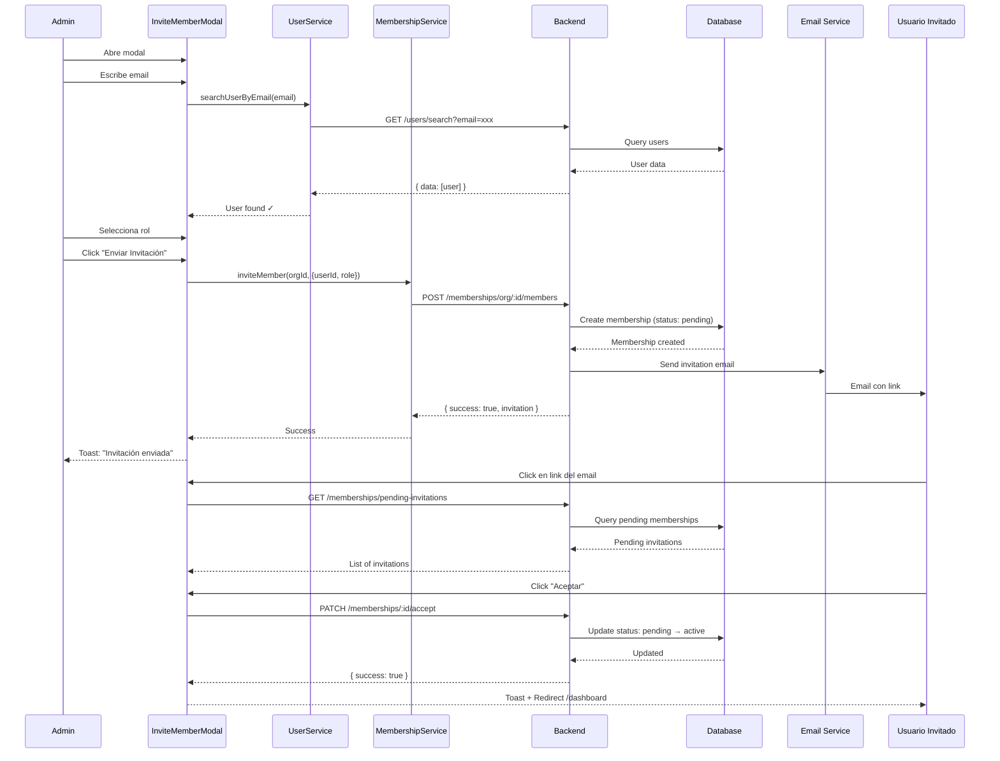

# Flujo de Invitaciones a Organizaciones

Este documento describe el flujo completo de invitaciones en CloudDocs Web UI, desde que un administrador invita a un usuario hasta que este acepta o rechaza la invitación.

## 📋 Tabla de Contenidos

- [Descripción General](#descripción-general)
- [Actores](#actores)
- [Requisitos Previos](#requisitos-previos)
- [Flujo Completo](#flujo-completo)
- [Componentes Involucrados](#componentes-involucrados)
- [Servicios y APIs](#servicios-y-apis)
- [Estados de Membresía](#estados-de-membresía)
- [Casos de Uso](#casos-de-uso)
- [Validaciones](#validaciones)
- [Notificaciones](#notificaciones)

---

## Descripción General

El sistema de invitaciones permite a los administradores y propietarios de organizaciones invitar a usuarios existentes a unirse a sus organizaciones. El flujo implementa:

- ✅ Búsqueda de usuarios por email en tiempo real
- ✅ Validación de usuario existente antes de invitar
- ✅ Creación de membresías en estado `pending`
- ✅ Notificaciones por email al usuario invitado
- ✅ Gestión de invitaciones pendientes
- ✅ Aceptación/rechazo de invitaciones
- ✅ Reenvío de invitaciones

---

## Actores

### 1. **Administrador/Propietario (Invitador)**
- Usuario con rol `admin` u `owner` en una organización
- Tiene permisos para invitar nuevos miembros
- Puede asignar roles a los invitados
- Puede reenviar invitaciones pendientes
- Puede revocar invitaciones

### 2. **Usuario Invitado**
- Usuario con cuenta existente en CloudDocs
- Recibe invitación por email
- Puede aceptar o rechazar la invitación
- Ve invitaciones pendientes en `/invitations`

---

## Requisitos Previos

### Para Invitar
1. El invitador debe tener rol `admin` u `owner` en la organización
2. Debe existir una organización activa
3. El usuario a invitar debe tener una cuenta existente (email registrado)

### Para Aceptar
1. El usuario invitado debe estar autenticado
2. La invitación debe estar en estado `pending`
3. La invitación no debe haber expirado (si aplica)

---

## Flujo Completo

### **Fase 1: Invitación**

```
┌─────────────────────────────────────────────────────────────┐
│ 1. ADMINISTRADOR ABRE MODAL DE INVITACIÓN                  │
└─────────────────────────────────────────────────────────────┘
                            │
                            ▼
┌─────────────────────────────────────────────────────────────┐
│ 2. ESCRIBE EMAIL DEL USUARIO A INVITAR                     │
│    - Sistema busca usuario en BD (debounce 500ms)          │
│    - Muestra feedback: ✓ Usuario encontrado / ✗ No existe  │
└─────────────────────────────────────────────────────────────┘
                            │
                            ▼
┌─────────────────────────────────────────────────────────────┐
│ 3. SELECCIONA ROL                                           │
│    Opciones: viewer | member | admin                       │
└─────────────────────────────────────────────────────────────┘
                            │
                            ▼
┌─────────────────────────────────────────────────────────────┐
│ 4. ENVÍA INVITACIÓN                                         │
│    POST /memberships/organization/:orgId/members            │
│    { userId: "user-123", role: "member" }                   │
└─────────────────────────────────────────────────────────────┘
                            │
                            ▼
┌─────────────────────────────────────────────────────────────┐
│ 5. BACKEND CREA MEMBERSHIP                                  │
│    - status: "pending"                                      │
│    - invitedBy: adminUserId                                 │
│    - Envía email de notificación al invitado               │
└─────────────────────────────────────────────────────────────┘
                            │
                            ▼
┌─────────────────────────────────────────────────────────────┐
│ 6. CONFIRMACIÓN                                             │
│    Toast: "Invitación enviada a user@example.com"          │
│    Lista de miembros se refresca                            │
└─────────────────────────────────────────────────────────────┘
```

### **Fase 2: Notificación**

```
┌─────────────────────────────────────────────────────────────┐
│ 1. USUARIO INVITADO RECIBE EMAIL                           │
│    - Asunto: "Invitación a [Organización]"                 │
│    - Contenido: Info de org, rol, invitador                │
│    - Link: https://app.clouddocs.com/invitations           │
└─────────────────────────────────────────────────────────────┘
```

### **Fase 3: Visualización de Invitaciones**

```
┌─────────────────────────────────────────────────────────────┐
│ 1. USUARIO ACCEDE A /invitations                           │
│    - Se autentica si es necesario                          │
└─────────────────────────────────────────────────────────────┘
                            │
                            ▼
┌─────────────────────────────────────────────────────────────┐
│ 2. SISTEMA CARGA INVITACIONES PENDIENTES                   │
│    GET /memberships/pending-invitations                     │
└─────────────────────────────────────────────────────────────┘
                            │
                            ▼
┌─────────────────────────────────────────────────────────────┐
│ 3. MUESTRA LISTA DE INVITACIONES                           │
│    Para cada invitación:                                    │
│    - Nombre de la organización                              │
│    - Plan (Free, Professional, Enterprise)                  │
│    - Rol asignado                                           │
│    - Nombre del invitador                                   │
│    - Tiempo transcurrido                                    │
│    - Botones: [Aceptar] [Rechazar]                         │
└─────────────────────────────────────────────────────────────┘
```

### **Fase 4: Aceptación/Rechazo**

#### **Opción A: Aceptar**

```
┌─────────────────────────────────────────────────────────────┐
│ 1. USUARIO HACE CLIC EN "ACEPTAR"                          │
└─────────────────────────────────────────────────────────────┘
                            │
                            ▼
┌─────────────────────────────────────────────────────────────┐
│ 2. SISTEMA ACTUALIZA MEMBERSHIP                            │
│    PATCH /memberships/:membershipId/accept                  │
│    - status: "pending" → "active"                           │
│    - joinedAt: fecha actual                                 │
└─────────────────────────────────────────────────────────────┘
                            │
                            ▼
┌─────────────────────────────────────────────────────────────┐
│ 3. CONFIRMACIÓN Y REDIRECCIÓN                              │
│    Toast: "Te has unido a [Organización]"                  │
│    Redirige a: /dashboard                                   │
│    Organización se activa automáticamente                   │
└─────────────────────────────────────────────────────────────┘
```

#### **Opción B: Rechazar**

```
┌─────────────────────────────────────────────────────────────┐
│ 1. USUARIO HACE CLIC EN "RECHAZAR"                         │
│    Confirmación: "¿Estás seguro de rechazar?"              │
└─────────────────────────────────────────────────────────────┘
                            │
                            ▼
┌─────────────────────────────────────────────────────────────┐
│ 2. SISTEMA ELIMINA MEMBERSHIP                              │
│    DELETE /memberships/:membershipId                        │
└─────────────────────────────────────────────────────────────┘
                            │
                            ▼
┌─────────────────────────────────────────────────────────────┐
│ 3. CONFIRMACIÓN                                             │
│    Toast: "Invitación rechazada"                            │
│    Invitación desaparece de la lista                        │
└─────────────────────────────────────────────────────────────┘
```

---

## Componentes Involucrados

### **Frontend**

#### 1. **InviteMemberModal** 
`src/components/Organization/InviteMemberModal.tsx`

**Propósito:** Modal para invitar nuevos miembros a la organización

**Características:**
- Búsqueda de usuarios por email con debounce (500ms)
- Validación en tiempo real (usuario encontrado/no encontrado)
- Selección de rol con descripciones
- Validación de permisos (solo admin/owner)
- Estados de carga y error
- Toast notifications

**Props:**
```typescript
interface Props {
  show: boolean;           // Controla visibilidad del modal
  onHide: () => void;      // Callback para cerrar
  onSuccess?: () => void;  // Callback después de invitar exitosamente
}
```

**Estados:**
```typescript
const [email, setEmail] = useState('');                    // Email del usuario
const [role, setRole] = useState('member');                // Rol seleccionado
const [loading, setLoading] = useState(false);             // Procesando invitación
const [searchingUser, setSearchingUser] = useState(false); // Buscando usuario
const [foundUser, setFoundUser] = useState<User | null>(null); // Usuario encontrado
```

**Validaciones:**
- ✅ Usuario debe tener permisos (admin/owner)
- ✅ Email debe ser válido (contener @)
- ✅ Usuario debe existir en el sistema
- ✅ Organización activa requerida

---

#### 2. **PendingInvitations** (Página)
`src/pages/PendingInvitations.tsx`

**Propósito:** Página para ver y gestionar invitaciones pendientes

**Características:**
- Lista todas las invitaciones pendientes del usuario
- Permite aceptar/rechazar invitaciones
- Redirección automática al dashboard después de aceptar
- Estado vacío cuando no hay invitaciones

**Hook principal:**
```typescript
const { invitations, loading, acceptInvitation, rejectInvitation } = useInvitations();
```

---

#### 3. **InvitationCard**
`src/components/Invitations/InvitationCard.tsx`

**Propósito:** Card individual para cada invitación

**Muestra:**
- Avatar de la organización (primera letra)
- Nombre de la organización
- Plan (badge con color)
- Invitador (nombre o email)
- Rol asignado (badge con color)
- Tiempo transcurrido
- Botones de acción

**Props:**
```typescript
interface InvitationCardProps {
  invitation: Invitation;
  onAccept: (id: string) => Promise<void>;
  onReject: (id: string) => Promise<void>;
}
```

---

#### 4. **OrganizationSettings** (Página)
`src/pages/OrganizationSettings.tsx`

**Propósito:** Página de gestión de miembros de la organización

**Características:**
- Lista de miembros actuales
- Botón "Invitar miembro" (abre InviteMemberModal)
- Búsqueda de miembros
- Cambio de roles
- Revocación de membresías
- Reenvío de invitaciones pendientes
- Muestra estado de cada membresía (active/pending)

**Funcionalidades para invitaciones:**
- Botón "Reenviar" para invitaciones con `status: 'pending'`
- Indicador visual de estado en la tabla

---

## Servicios y APIs

### **Frontend Services**

#### 1. **membership.services.ts**

```typescript
/**
 * Invita un usuario a una organización
 * POST /api/memberships/organization/:organizationId/members
 */
export const inviteMember = async (
  organizationId: string,
  payload: InviteMemberPayload
): Promise<InviteMemberResponse>

interface InviteMemberPayload {
  userId: string;  // ID del usuario a invitar
  role?: string;   // Rol: viewer | member | admin
}

interface InviteMemberResponse {
  success: boolean;
  message?: string;
  invitation?: Membership | null;  // Devuelve membership en estado PENDING
}
```

---

#### 2. **user.services.ts**

```typescript
/**
 * Busca usuarios por email
 * GET /api/users/search?email=xxx
 */
export const searchUserByEmail = async (
  email: string
): Promise<User | null>

interface User {
  id: string;
  name?: string | null;
  email: string;
  avatar?: string | null;
}

interface SearchUsersResponse {
  success: boolean;
  data: User[];
}
```

---

#### 3. **useInvitations.ts** (Hook)

```typescript
export const useInvitations = () => {
  const [invitations, setInvitations] = useState<Invitation[]>([]);
  const [loading, setLoading] = useState(true);

  // Carga invitaciones pendientes
  const fetchInvitations = async () => {
    // GET /memberships/pending-invitations
  }

  // Acepta una invitación
  const acceptInvitation = async (id: string) => {
    // PATCH /memberships/:id/accept
  }

  // Rechaza una invitación
  const rejectInvitation = async (id: string) => {
    // DELETE /memberships/:id
  }

  return { invitations, loading, acceptInvitation, rejectInvitation };
}
```

---

### **Backend Endpoints**

#### **Crear Invitación**
```
POST /api/memberships/organization/:organizationId/members
Body: { userId: string, role: string }

Respuesta:
{
  "success": true,
  "message": "Invitación enviada",
  "invitation": {
    "id": "membership-123",
    "user": "user-456",
    "organization": "org-789",
    "role": "member",
    "status": "pending",
    "invitedBy": "admin-user-id",
    "createdAt": "2026-02-04T10:00:00Z"
  }
}
```

#### **Listar Invitaciones Pendientes**
```
GET /api/memberships/pending-invitations

Respuesta:
{
  "success": true,
  "data": [
    {
      "id": "membership-123",
      "organization": {
        "id": "org-789",
        "name": "Acme Corp",
        "plan": "professional"
      },
      "role": "member",
      "status": "pending",
      "invitedBy": {
        "id": "user-admin",
        "name": "John Admin",
        "email": "admin@acme.com"
      },
      "createdAt": "2026-02-04T10:00:00Z"
    }
  ]
}
```

#### **Aceptar Invitación**
```
PATCH /api/memberships/:membershipId/accept

Respuesta:
{
  "success": true,
  "message": "Invitación aceptada",
  "membership": {
    "id": "membership-123",
    "status": "active",
    "joinedAt": "2026-02-04T11:00:00Z"
  }
}
```

#### **Rechazar Invitación**
```
DELETE /api/memberships/:membershipId

Respuesta:
{
  "success": true,
  "message": "Invitación rechazada"
}
```

#### **Reenviar Invitación**
```
POST /api/memberships/organization/:orgId/members/:membershipId/resend

Respuesta:
{
  "success": true,
  "message": "Invitación reenviada"
}
```

---

## Estados de Membresía

```typescript
type MembershipStatus = 'active' | 'pending' | 'suspended';
```

### **pending**
- Invitación enviada pero no aceptada
- Usuario no tiene acceso a la organización
- Aparece en `/invitations` del usuario invitado
- Aparece en lista de miembros con estado "pending"
- Administrador puede reenviar email

### **active**
- Invitación aceptada
- Usuario tiene acceso completo según su rol
- Aparece en lista de miembros de la organización
- Puede acceder a recursos de la organización

### **suspended**
- Membresía temporalmente deshabilitada
- Usuario no puede acceder a la organización
- No se usa en el flujo de invitaciones actual

---

## Casos de Uso

### **Caso 1: Invitación Exitosa**

**Precondiciones:**
- Usuario admin autenticado
- Organización activa seleccionada
- Usuario a invitar existe en el sistema

**Flujo:**
1. Admin abre modal de invitación
2. Escribe email: `newuser@example.com`
3. Sistema encuentra usuario ✓
4. Admin selecciona rol: `member`
5. Hace clic en "Enviar Invitación"
6. Backend crea membership con `status: 'pending'`
7. Se envía email al usuario invitado
8. Toast: "Invitación enviada a newuser@example.com"
9. Modal se cierra
10. Lista de miembros se refresca mostrando invitación pendiente

**Postcondiciones:**
- Membership creado en BD con status `pending`
- Email enviado al usuario
- Usuario ve invitación en `/invitations`

---

### **Caso 2: Usuario No Existe**

**Precondiciones:**
- Usuario admin autenticado
- Email ingresado no corresponde a ninguna cuenta

**Flujo:**
1. Admin escribe email: `noexiste@example.com`
2. Sistema busca usuario (500ms debounce)
3. No encuentra usuario
4. Muestra: "Usuario no encontrado. Verifica el email."
5. Botón "Enviar Invitación" permanece deshabilitado

**Postcondiciones:**
- No se crea ninguna membresía
- No se envía ningún email
- Admin debe verificar el email o el usuario debe registrarse primero

---

### **Caso 3: Usuario Ya es Miembro**

**Precondiciones:**
- Usuario a invitar ya tiene membership activo

**Flujo:**
1. Admin intenta invitar usuario existente
2. Backend valida y detecta membership activo
3. Responde con error: `{ error: "El usuario ya es miembro" }`
4. Frontend muestra toast de error

---

### **Caso 4: Aceptar Invitación**

**Precondiciones:**
- Usuario invitado autenticado
- Tiene invitación pending

**Flujo:**
1. Usuario navega a `/invitations`
2. Ve card con detalles de la invitación
3. Hace clic en "Aceptar"
4. Backend actualiza `status: 'pending'` → `'active'`
5. Establece `joinedAt: now()`
6. Frontend muestra toast: "Te has unido a [Organización]"
7. Redirige a `/dashboard`
8. Organización se activa automáticamente

**Postcondiciones:**
- Membership status = `active`
- Usuario puede acceder a la organización
- Invitación desaparece de `/invitations`

---

### **Caso 5: Reenviar Invitación**

**Precondiciones:**
- Admin ve miembro con status `pending`
- Invitación fue enviada hace tiempo

**Flujo:**
1. Admin hace clic en botón "Reenviar"
2. Modal de confirmación
3. Backend reenvía email de invitación
4. Toast: "Invitación reenviada"

---

## Validaciones

### **Frontend**

1. **Permisos:**
   - Solo admin/owner pueden abrir modal
   - Campos deshabilitados si no tiene permisos

2. **Email:**
   - Debe contener `@`
   - No puede estar vacío
   - Debounce de 500ms antes de buscar

3. **Usuario:**
   - Debe existir en el sistema
   - Botón enviar deshabilitado si no existe

4. **Organización:**
   - Debe haber organización activa
   - Error si no hay organización

### **Backend (esperado)**

1. **Usuario ya es miembro:**
   - Verificar si existe membership activo
   - Retornar error 400

2. **Invitación duplicada:**
   - Verificar si ya tiene invitación pending
   - Retornar error 409

3. **Permisos:**
   - Validar que quien invita es admin/owner
   - Retornar error 403

4. **Usuario existe:**
   - Validar que userId existe
   - Retornar error 404

---

## Notificaciones

### **Toast Notifications (Frontend)**

#### **Éxito:**
- "Invitación enviada a {email}. Se ha enviado un email con el link de aceptación."
- "Rol actualizado"
- "Miembro revocado"
- "Invitación reenviada"
- "Te has unido a {organización}"

#### **Error:**
- "No hay organización activa"
- "Usuario no encontrado"
- "Error al invitar"
- "El usuario ya es miembro"
- "No puedes cambiar tu propio rol"
- "No puedes revocar tu propia membresía"

#### **Advertencia:**
- "Necesitas permisos de administrador para invitar miembros"

---

### **Email Notifications (Backend)**

#### **Email de Invitación:**
**Asunto:** "Invitación a {Nombre Organización}"

**Contenido:**
```
Hola {NombreUsuario},

{NombreAdmin} te ha invitado a unirte a {NombreOrganización} como {Rol}.

[Botón: Aceptar Invitación]

Esta invitación es personal y no puede ser transferida.

Si no esperabas esta invitación, puedes ignorar este email.

---
CloudDocs Copilot Team
```

**Link:** `https://app.clouddocs.com/invitations`

---

## Diagramas de Secuencia

### **Flujo Completo**



---

## Testing

Tests implementados en:
- `src/__tests__/components/InviteMemberModal.test.tsx`

**Cobertura:**
- ✅ Renderizado básico
- ✅ Permisos (admin/owner)
- ✅ Búsqueda de usuarios
- ✅ Selección de roles
- ✅ Envío de invitación
- ✅ Manejo de errores
- ✅ Estados de carga
- ✅ Validaciones

**Ejecutar tests:**
```bash
npm test -- InviteMemberModal.test.tsx
```

---

## Mejoras Futuras

### **Fase 3 (Propuesta): Invitación a No-Usuarios**

Actualmente el sistema **requiere** que el usuario exista. Una mejora sería:

1. Permitir enviar invitación a emails no registrados
2. Crear un token de invitación único
3. Email incluye link: `/register?invitation=token`
4. Al registrarse, automáticamente unirse a la organización
5. Token expira después de X días

**Beneficios:**
- Invitar usuarios que aún no tienen cuenta
- Proceso más fluido de onboarding
- Reduce fricción para nuevos usuarios

---

## Referencias

- [AGENTS.md](../AGENTS.md) - Guías de desarrollo
- [ARCHITECTURE.md](ARCHITECTURE.md) - Arquitectura general
- [Membership Types](../src/types/membership.types.ts)
- [Organization Types](../src/types/organization.types.ts)
- [Invitation Types](../src/types/invitation.types.ts)

---

**Última actualización:** 4 de Febrero, 2026
